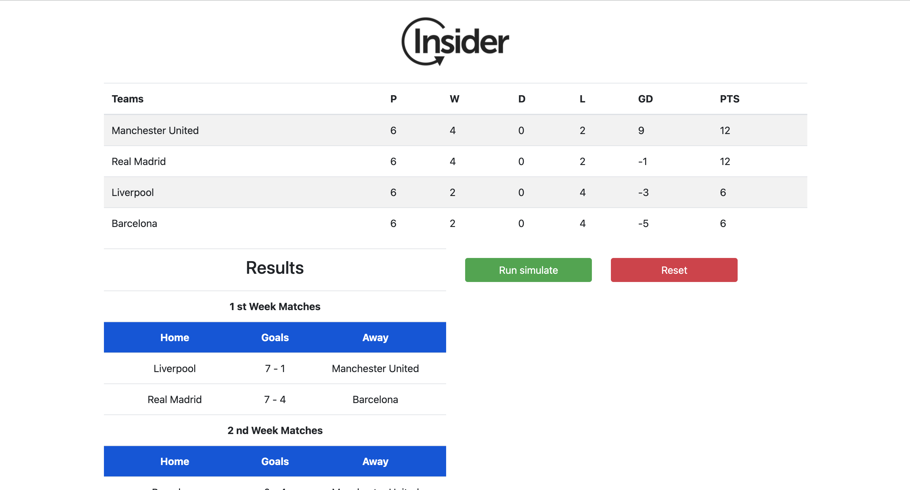

# How to Run the Insider Champions League Project

## Install PHP Dependencies

Make sure you have PHP 8+ and Composer installed.

In the project root, run: `composer install` 

## Set Up Environment

Copy the example environment file: `cp .env.example .env`

Open `.env` in your editor and configure the necessary settings, such as database credentials.

Generate the application key required by Laravel: `php artisan key:generate`

This will populate the `APP_KEY` in your `.env` file.

## Configure Database (Optional)

If the project uses a database:

 - SQLite: create a database file: 

   - `mkdir -p database`
   - `touch database/database.sqlite`

 - MySQL/PostgreSQL: update `.env` with your database credentials.

Run migrations:

`php artisan migrate`

After migrations, seed the database with initial data:

`php artisan db:seed`

## Install Frontend Dependencies

If the project uses a frontend build system (there is a `package.json`), install dependencies:

`npm install`

### Build frontend assets:

For development
`npm run dev`

For production
`npm run build`

## Run the Project

Start Laravel's built-in server:

`php artisan serve`

Open your browser at:

` 👉 http://localhost:8000 `

